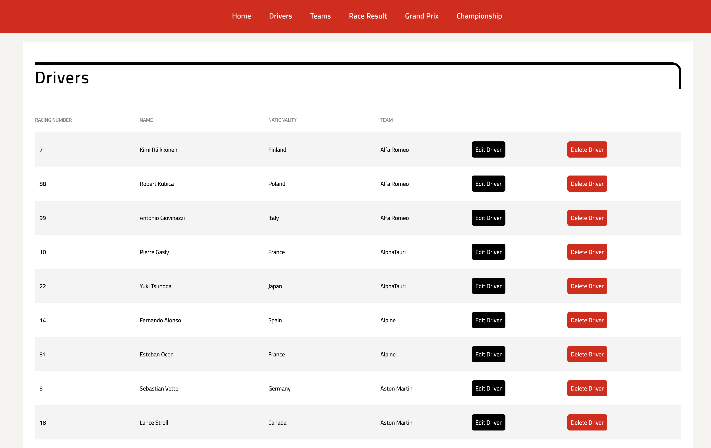
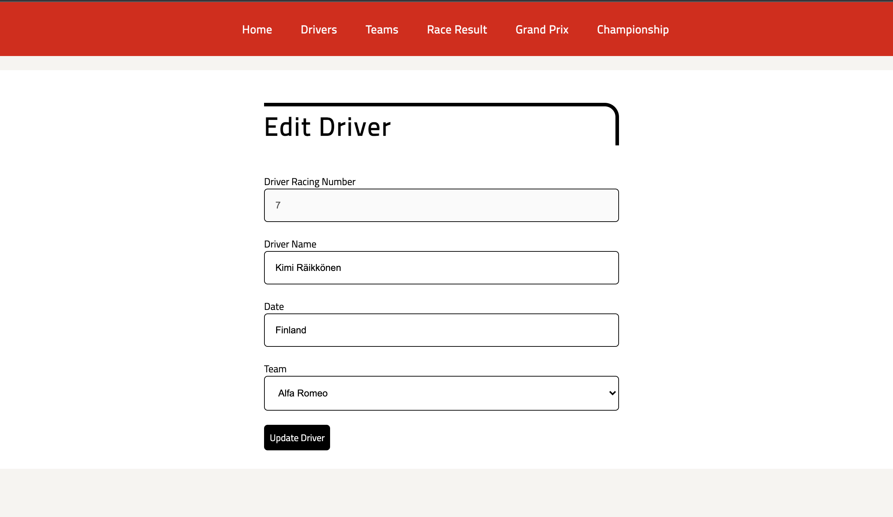
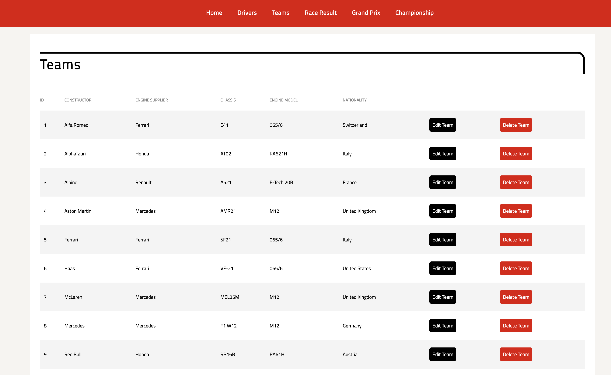
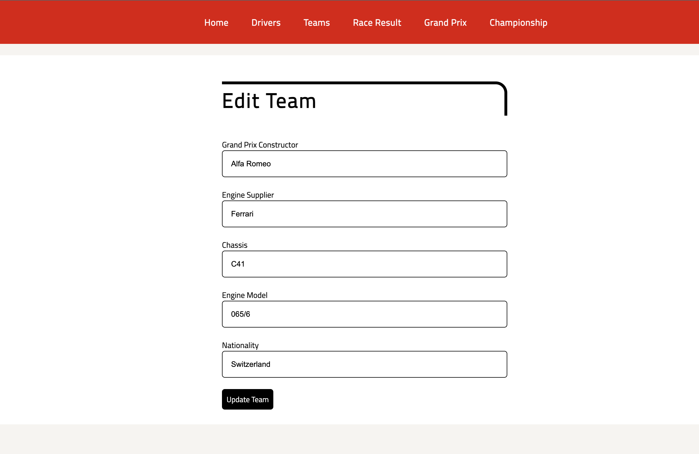
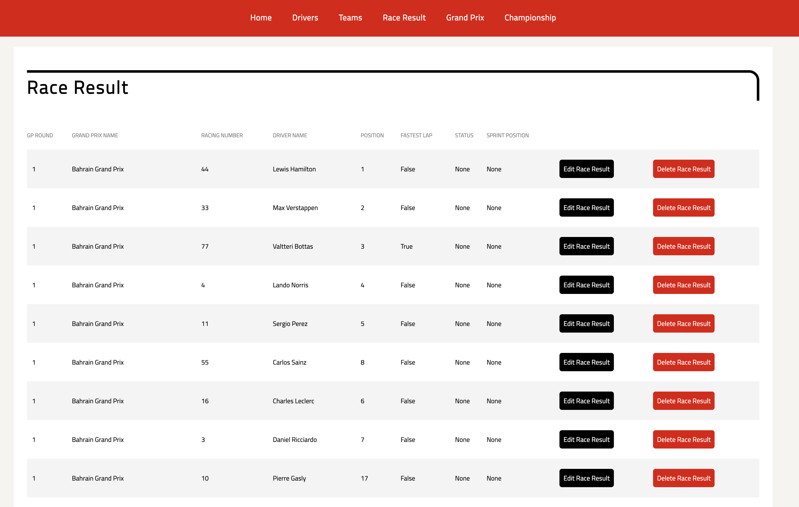
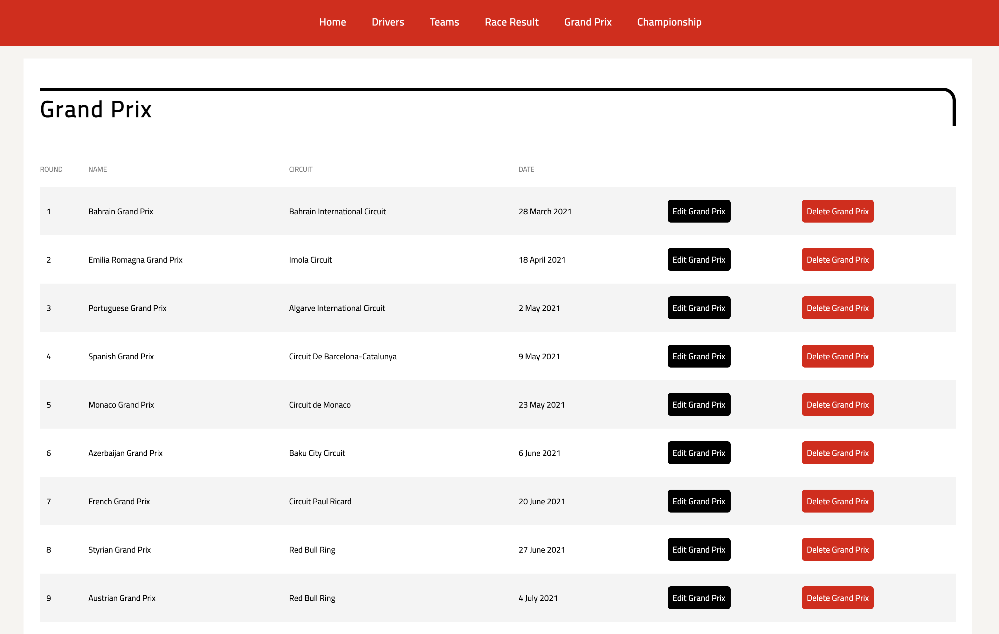
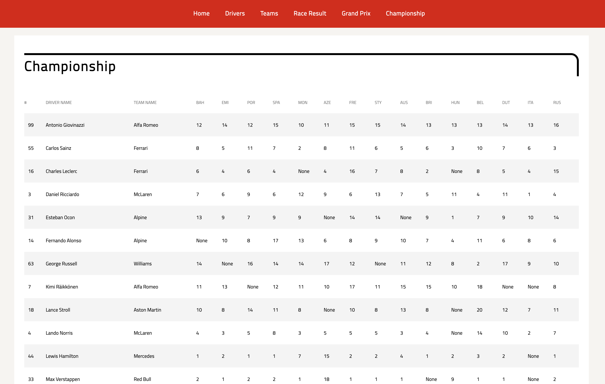

# Formula One - an app for F1 fans following the championship in 2021!


You will be able to :
* see the names of all the drivers in the championship, edit or delete them and even add a new one
* see all the teams participating this year, edit or delete them and add a new one
* keep on top of all the grands prix of the year 2021, edit, delete them or create a new one
* view all the race results for each driver in each grand prix, edit or delete them and even add new ones.

## Before you start you wil need to :

```

have Python3, pip3 and postgreSQL installed

install Flask - pip3 install flask

install psycopg2 - pip3 install psycopg2

clone project - git clone <project SSH link>

create a database - createdb formula_one

create the database structure - psql -d formula_one -f db/formula_one.sql

python3 console.py

start Flask - flask run

visit website - http://localhost:5000
```
Homepage 


Drivers



Edit Driver



Teams



Edit Team



Race Result



Grand Prix



Championship




